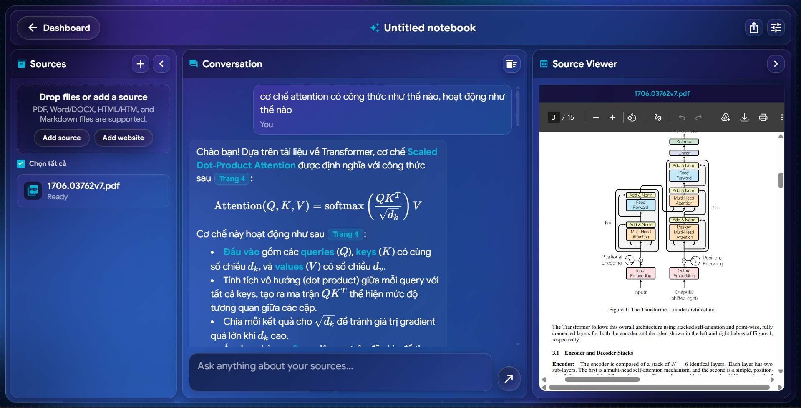
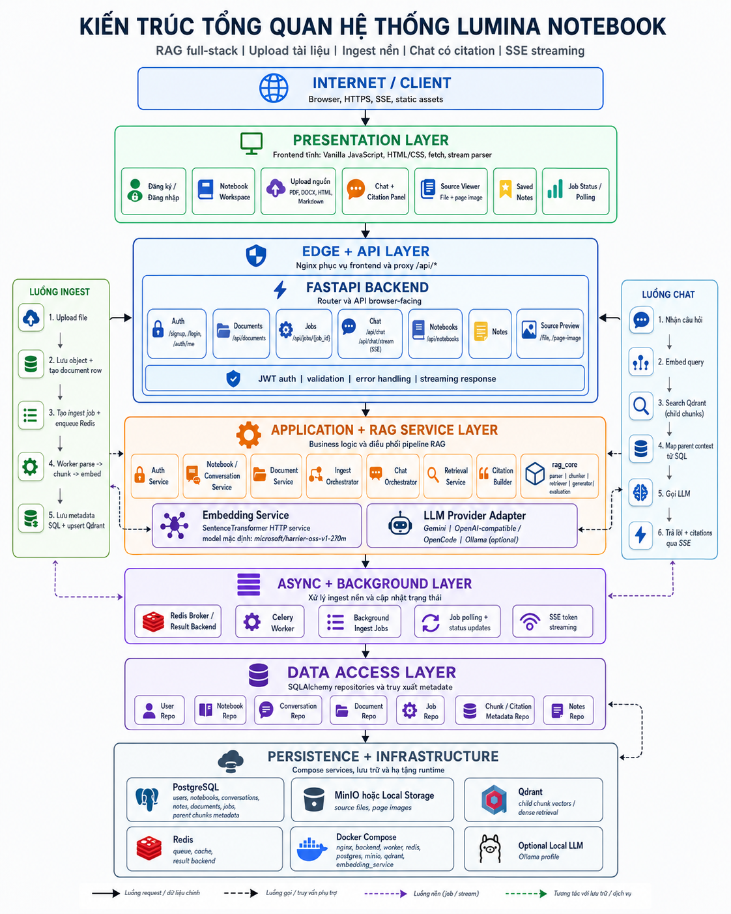

<div align="center">

# Lumina Notebook

Ứng dụng Retrieval-Augmented Generation (RAG) để tải tài liệu, lập chỉ mục nền, trò chuyện với nguồn học tập, và trả lời có trích dẫn.



[Website](http://luminanotebook.koreacentral.cloudapp.azure.com/) |
[Report](REPORT\Report.pdf) |
[Feedback](https://github.com/DinhIchMinhHoang/RAG-Philosophy/issues)

</div>

## Giới Thiệu

Lumina Notebook là một ứng dụng RAG full-stack cho phép người dùng đăng ký, đăng nhập, tải nguồn tài liệu lên, chờ hệ thống lập chỉ mục, rồi đặt câu hỏi trong không gian notebook trên trình duyệt. Câu trả lời được tạo từ nội dung đã truy xuất và đi kèm citation để người dùng kiểm tra nguồn.

Runtime chính của ứng dụng nằm ở `backend/app/` và `frontend/`. Phần lõi RAG dùng chung nằm ở `rag_core/`, bao gồm parser, chunker, retriever, generator, embedding helper, kiểm thử và các tiện ích đánh giá.


## Tính Năng Chính

### Người Dùng Và Tài Khoản

| Tính năng | Mô tả |
| --- | --- |
| Xác thực | Đăng ký, đăng nhập, đổi mật khẩu |
| Đặt lại mật khẩu | Gửi, xác minh và reset bằng mã |
| Phiên đăng nhập | Bearer JWT cho API được bảo vệ |

### Tài Liệu Và Ingest

| Tính năng | Mô tả |
| --- | --- |
| Upload nguồn | PDF, DOCX, HTML/HTM, Markdown |
| Job nền | Theo dõi trạng thái ingest |
| Xử lý tài liệu | Parse, chunk, embed, index |
| Citation metadata | Giữ `source`, `page`, `doc_id` |

### RAG Và Chat

| Tính năng | Mô tả |
| --- | --- |
| Dense retrieval | Tìm child vectors trong Qdrant |
| Parent context | Lấy context đầy đủ từ SQL |
| Chat có citation | Trả lời grounded theo nguồn |
| Streaming chat | SSE qua `/api/chat/stream` |

### Notebook Và Giao Diện

| Tính năng | Mô tả |
| --- | --- |
| Notebook workspace | Quản lý nguồn và hội thoại |
| Source viewer | Xem file và ảnh trang tài liệu |
| Saved notes | Lưu nội dung theo notebook |
| Frontend tĩnh | Vanilla JS, HTML/CSS, stream parser |

### Triển Khai

| Tính năng | Mô tả |
| --- | --- |
| Docker Compose | Nginx, backend, worker, Redis, Postgres, MinIO, Qdrant |
| Embedding service | SentenceTransformer HTTP service riêng |
| Local LLM | Tùy chọn Ollama profile |
| VM stack | Compose riêng cho VM nhỏ |

## Kiến Trúc

```text
Browser
  |
  |  /api/*
  v
Nginx
  |
  +--> FastAPI backend -----> Postgres
  |         |                   ^
  |         | enqueue           |
  |         v                   |
  |      Redis -----> Celery worker
  |                     |
  |                     +--> Object storage (MinIO hoặc local)
  |                     +--> Parser/chunker trong rag_core
  |                     +--> Embedding service
  |                     +--> Qdrant vector database
  |
  +--> Static frontend assets
```

Luồng ingest chính:

1. Frontend upload file được hỗ trợ tới `POST /api/documents`.
2. Backend lưu object, tạo document row, tạo ingest job và enqueue worker.
3. Worker lấy object, parse tài liệu, chia text thành parent/child chunks, embed child chunks, upsert vector vào Qdrant và lưu metadata vào SQL.
4. Khi chat, backend embed câu hỏi, search Qdrant theo child chunks, map kết quả về parent chunks, tạo citations và gửi context đã grounded tới LLM provider.
5. Frontend hiển thị câu trả lời, citation và source preview.

## Công Nghệ

| Lớp | Công nghệ hiện tại |
| --- | --- |
| Backend API | Python, FastAPI, Uvicorn, Pydantic |
| Persistence | SQLAlchemy, Postgres trong Compose, SQLite fallback khi chưa đặt `DATABASE_URL` |
| Queue | Celery với Redis |
| Object storage | MinIO trong Compose, tùy chọn local filesystem |
| Vector database | Qdrant |
| Embeddings | SentenceTransformer HTTP service riêng, model mặc định `microsoft/harrier-oss-v1-270m` |
| RAG pipeline | `rag_core/` parser, chunker, vector, retriever, generator và evaluation utilities |
| LLM providers | Gemini, OpenCode/OpenAI-compatible APIs, tùy chọn local Ollama |
| Frontend | Vanilla JavaScript ES modules, static HTML/CSS, `fetch`, stream parsing, marked, KaTeX |
| Edge | Nginx phục vụ frontend và proxy `/api/*` |

## Cấu Trúc Repository

```text
RAG-Philosophy/
├── README.md
├── AGENTS.md
├── .env.example
├── requirements.txt
├── start.bat
├── docker-compose.yml
├── docker-compose.vm.yml
├── docker-compose.gpu.yml
├── rag_core/                  # Parser, chunker, retrieval, generation, evaluation
│   ├── common/                # LLM, embedding, logging, PDF utilities
│   ├── parsers/               # Parser mở rộng cho từng loại dữ liệu
│   └── tests/                 # Unit tests cho lõi RAG
├── backend/
│   ├── app/                   # FastAPI app, routers, services, models, worker
│   └── tests/                 # Backend regression và unit tests
├── frontend/
│   ├── src/                   # Vanilla JS app, scenes, state, API client
│   ├── styles/                # CSS nền, layout, component, scene
│   └── tests/                 # Frontend unit và Playwright tests
├── embedding_service/         # SentenceTransformer HTTP service
├── docker/
│   ├── nginx/                 # Reverse proxy config
│   ├── backend.Dockerfile     # Backend/worker image
│   ├── embedding.Dockerfile   # Embedding service image
│   └── ollama-entrypoint.sh   # Optional local LLM entrypoint
├── docs/                      # API, architecture, RAG, frontend, debugging, evaluation
└── data/                      # Runtime data, samples, processed files, screenshots
```

## Cài Đặt

### Yêu Cầu

- Python 3.10 trở lên.
- Docker Desktop có Docker Compose.
- Node.js nếu cần chạy frontend tests hoặc helper `npm run serve`.
- API key cho LLM/OCR provider được bật trong cấu hình.

Tạo cấu hình local:

```bash
cp .env.example .env
```

Sau đó chỉnh `.env` và thay các giá trị placeholder như `SECRET_KEY`, `GEMINI_API_KEY`, `OPENCODE_API_KEY`, OCR credentials và SMTP credentials nếu cần. Không commit `.env`.


### Chạy Bằng Docker Compose

```bash
docker compose up -d
```

Mở ứng dụng tại:

```text
http://localhost
```

OpenAPI docs của backend được proxy qua Nginx tại:

```text
http://localhost/api/docs
```

Với VM nhỏ dùng prebuilt images và resource limits thấp hơn:

```bash
docker compose -f docker-compose.vm.yml up -d
```

Tùy chọn bật local Ollama fallback:

```bash
docker compose --profile local-llm up -d
```

## Cấu Hình

Runtime được cấu hình bằng biến môi trường. Các nhóm biến quan trọng:

| Nhóm | Biến |
| --- | --- |
| App/runtime | `APP_ENV`, `PIPELINE_VERSION`, `SERVICE_NAME`, `API_SERVICE_NAME` |
| Auth | `SECRET_KEY`, `ALGORITHM`, `ACCESS_TOKEN_EXPIRE_MINUTES` |
| Database/queue | `DATABASE_URL`, `REDIS_BROKER_URL`, `REDIS_RESULT_BACKEND`, `CELERY_INGEST_QUEUE` |
| Object storage | `OBJECT_STORAGE_BACKEND`, `OBJECT_STORAGE_LOCAL_ROOT`, `MINIO_ENDPOINT`, `MINIO_ACCESS_KEY`, `MINIO_SECRET_KEY`, `MINIO_BUCKET` |
| Qdrant | `QDRANT_URL`, `QDRANT_HOST`, `QDRANT_PORT`, `QDRANT_COLLECTION`, `QDRANT_API_KEY` |
| Embeddings | `EMBEDDING_SERVICE_URL`, `EMBEDDING_MODEL_NAME`, `EMBEDDING_DEVICE`, `EMBEDDING_BATCH_SIZE` |
| Retrieval | `RETRIEVAL_MODE`, `RETRIEVAL_TOP_K` |
| LLM | `LLM_MODE`, `LLM_PROVIDER`, `LLM_MODEL`, `GEMINI_API_KEY`, `OPENCODE_API_KEY`, `OPENCODE_API_BASE`, `LOCAL_LLM_BASE_URL`, `LOCAL_LLM_MODEL` |
| OCR | `OCR_PROVIDER`, `OCR_API_BASE_URL`, `OCR_API_KEY`, `OCR_MODEL` |
| Email | `SMTP_HOST`, `SMTP_PORT`, `SMTP_USER`, `SMTP_PASSWORD`, `SMTP_USE_TLS`, `EMAIL_FROM` |

`backend/app/core/settings.py` quản lý cấu hình runtime của backend và worker. `rag_core/config.py` vẫn là bề mặt cấu hình cho lõi RAG dùng chung. Khi đổi embedding model, LLM provider, Qdrant collection hoặc retrieval behavior, cần giữ hai lớp cấu hình này đồng bộ.

## API Chính

Các endpoint browser-facing nằm dưới `/api/*`.

### Auth

| Method | Endpoint | Mô tả |
| --- | --- | --- |
| POST | `/api/signup` | Tạo tài khoản |
| POST | `/api/login` | Đăng nhập và nhận token |
| POST | `/api/change-password` | Đổi mật khẩu |
| POST | `/api/password/forgot` | Gửi mã đặt lại mật khẩu |
| POST | `/api/password/verify` | Xác minh mã đặt lại |
| POST | `/api/password/reset` | Đặt mật khẩu mới |
| GET | `/api/auth/me` | Lấy thông tin người dùng hiện tại |

### Documents Và Ingest

| Method | Endpoint | Mô tả |
| --- | --- | --- |
| POST | `/api/documents` | Upload tài liệu |
| GET | `/api/documents` | Danh sách tài liệu |
| DELETE | `/api/documents/{document_id}` | Xóa tài liệu |
| POST | `/api/documents/{document_id}/reindex` | Lập chỉ mục lại |
| GET | `/api/jobs/{job_id}` | Xem trạng thái ingest job |
| GET | `/api/documents/{document_id}/file` | Xem file nguồn |
| GET | `/api/documents/{document_id}/page-image/{page_number}` | Xem ảnh trang |

### Chat Và Notebooks

| Method | Endpoint | Mô tả |
| --- | --- | --- |
| POST | `/api/chat` | Chat không stream |
| POST | `/api/chat/stream` | Chat streaming bằng SSE |
| GET | `/api/notebooks` | Danh sách notebooks |
| POST | `/api/notebooks` | Tạo notebook |
| PATCH | `/api/notebooks/{notebook_id}` | Cập nhật notebook |
| DELETE | `/api/notebooks/{notebook_id}` | Xóa notebook |
| GET | `/api/notebooks/{notebook_id}/conversations/latest` | Lấy hội thoại gần nhất |
| POST | `/api/notebooks/{notebook_id}/notes` | Lưu note/pin/summary |

Các endpoint được bảo vệ cần header:

```text
Authorization: Bearer <access_token>
```

SSE token event:

```text
data: {"type":"token","token":"...","done":false}
```

SSE final event:

```text
data: {"type":"final","token":"","done":true,"answer":"...","citations":[],"conversation_id":"...","message_id":"...","rewritten_query":"..."}
```

SSE error event:

```text
data: {"type":"error","token":"","done":true,"error":"...","citations":[]}
```

Xem `docs/api/non-admin-contract-v1.md` để biết contract non-admin hiện tại.

## Kiểm Thử

Kiểm tra cú pháp Python:

```bash
python -m compileall backend rag_core -q
```

Chạy tests của RAG core:

```bash
python -m unittest discover rag_core/tests -v
```

Chạy backend tests:

```bash
python -m unittest discover backend/tests -v
```

Chạy frontend unit tests:

```bash
cd frontend
npm test
```

Chạy frontend Playwright tests:

```bash
cd frontend
npm run test:e2e
```

Chạy RAG smoke test:

```bash
python rag_core/main_test.py
```

Chạy evaluation script:

```bash
python rag_core/ragas_eval.py --dataset data/dataset.json --out data/result.csv --records-in data/ragas_records.json
```

## Trạng Thái Hiện Tại Và Giới Hạn

Đã hoạt động và hữu ích hiện tại:

- Upload có xác thực, ingest nền, job polling, persistent chunks, Qdrant indexing, dense retrieval, citation-grounded chat và SSE streaming.
- Frontend notebook workspace cho upload nguồn, chat, xem source document và quản lý notebook state.
- Local deployment bằng Compose với volumes cho Postgres, MinIO, Qdrant, Redis và embedding service.
- Tests cho các hành vi quan trọng của backend, frontend API/client, RAG pipeline utilities, hybrid retrieval experiments và LLM provider selection.

Giới hạn đã biết:

- Excel và CSV upload/query đang tạm thời bị tắt; `.xlsx`, `.xls` và `.csv` trả về `400 Unsupported format`.
- `RETRIEVAL_MODE=hybrid` tồn tại trong backend setting, nhưng backend persistent chat path hiện vẫn fallback về dense retrieval.
- Reranking code có trong `rag_core`, nhưng chưa nằm trong backend persistent retrieval path.
- Evaluation scripts đang chạy thủ công, chưa phải quality gate tự động.
- Cấu hình runtime đang tách giữa backend settings và `rag_core/config.py`.
- Repo hiện chưa có database migration framework; local schema creation được backend xử lý runtime.
- Production hardening vẫn cần quản lý secret chặt hơn, CORS/TLS posture, observability và resource planning theo môi trường triển khai.

## Tài Liệu

- `docs/PROJECT_OVERVIEW.md` - phân tích kiến trúc và rủi ro theo trạng thái hiện tại.
- `docs/architecture/deployment.md` - Docker Compose, VM stack, health checks, GPU notes và streaming validation.
- `docs/api/non-admin-contract-v1.md` - API contract non-admin canonical.
- `docs/rag/` - retrieval, embedding, LLM provider và ghi chú pipeline RAG.
- `docs/frontend/` - kiến trúc frontend và API integration.
- `docs/debugging/` - hướng dẫn debug retrieval, ingest và runtime issues.
- `docs/evaluation/` - benchmark và hướng dẫn đánh giá RAGAS.
